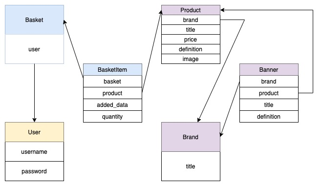

# Online store on Django

## Main dependencies.
- Python 3.7
- Django framework
- SQLite database
- all dependencies you can see in requirements.txt ...

## Build and launch the app
1. Clone the project
2. Setup environment  
`pip install pipenv`
3. Install dependencies  
`pip install -r requirements.txt`
4. Initialization database and execution migrations    
`python manage.py makemigrations`  
`python manage.py migrate`
5. Upload data from fixture   
`python manage.py loaddata fixtures/database_data.json`    
This command:  
	- import users, banners, products, baskets.
	- create _**superuser with name "manager", password "manager"**_.
	- create _**user: "Bob" , password: "22bobbob"**_
	- create _**user: "Kate", password : "333exexex"**_
	- create group "managers".
6. Run server  
`python manage.py runserver`

##### App is accessed on http://0.0.0.0:8000/

## Custom files and folders

### Apps:

- `users` - app for user`s basket logic (users are from default django user model).
- `goods` - app for brands\`, products\`, banners` logic.  

### Files

- templates/ - for all templates
- static/media/pictures/ - for product`s images  
- fixtures/database\_data.json - data for database
- information/ - folder with images for README 

## Database structure

## User flow
- `/` main page contains:  
	-  products with links to products` pages.
	-  banners ( information about banner`s brand and product with the ability to go to the product page ).
	- for auth user:
		-  link, that deauthorize user `/logout` .
		-  link to user\`s basket `/basket`.
	- for not auth user:
		- link to login page `/login` .

- `/basket` basket page contains:  
	- user purchase with links to products` pages.
	- quantity of purchase.
	- ability to delete purchase from basket.
	- link to main page.
	
- `/product/<product_id>` product page contains:  
	- form for purchase with the ability to buy a certain amount of product.
	- link to main page.
	- information about product(price, title, definition, image).

- `/login` login page contains:  
	- ability to login.
	- link to admin login page `/admin/login`.
	- link to registration page  `/register/`.
	
- `/logout` logout page contains:  
	- link to login page `/login`.
	
- `/register` register page contains:  
	- ability to create account.
	- link to login page `/login`.

## Admin site

It contains:   
 
- information about users` baskets.
- information about products, brands, banners.
- ability to add product, brand, banner and information about it( including images for products)
- information about users and group. 
- ability to add users, groups and modify it.
